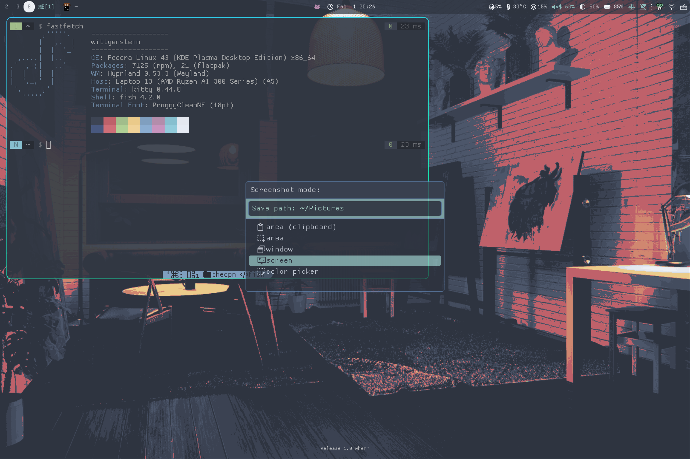

# Theo's short-lived Hy3-based Hyprland Config



I fell for the hype and tried Hyprland for a week or two.

A couple of reasons I was trying out Hyprland over Swayfx:

1. Handles fractional scaling much better (by disabling hard scaling for XWayland apps entirely and using X11 native scaling like `~/.Xresources`)
2. I liked some utilities in the "Hypr ecosystem" (especially `xdg-desktop-portal-hypr`, `hyprsunset`, and `hyprlock`)
3. It is relatively painless to configure

But two days later, I switched to [Niri](https://github.com/theopn/niriniri).

1. Niri's solution of using XWayland-satellite is even better than Hyprland's XWayland support
2. I can reuse pretty much all the tools I configured for Sway
3. Hyprland's default tiling model was awful and pretty much required Hy3, whereas I really like Niri's scrollable model
4. Fewer weird people in the community

I enjoyed using it, maybe I will come back to it.

## Installation

> [!IMPORTANT]
> Some keymaps and functionality depend on the scripts from my [Haunted-Tiles](https://github.com/theopn/haunted-tiles) repository (my Sway config).
> Make sure to clone the repository and copy the content in the `scripts` directory to somewhere in your $PATH

```sh
# Official repository recommends solopasha/hyprland, but as of December 2025, it has been unmaintained
sudo dnf copr enable sdegler/hyprland
sudo dnf install hyprland
sudo dnf install hyprpaper hypridle hyprlock hyprsunset hyprpolkitagent hyprland-qt-support
sudo dnf install dunst rofi waybar

# Install hy3
sudo dnf install aquamarine-devel hyprland-devel
hyprpm update
hyprpm add https://github.com/outfoxxed/hy3

# if stow has not been installed
sudo dnf install stow
cd $HOME
git@github.com:theopn/hyprdots.git
cd hyprdots

stow hypr
stow dunst
stow rofi
stow waybar
```

## Usage

Read [keybindings.conf](./hypr/.config/hypr/config/keybindings.conf).

## XWayland and Fractional Scaling

In my Framework 13 with the 2.8k display, I use fractional scaling (1.67).
Out of the box, XWayland applications will be hard-scaled, making them look pixelated.
The workaround is to disable scaling for XWayland applications and create the X11 config file (`~/.Xresources`) with the DPI value.

```sh
# 1.67 * 100
echo "Xft.dpi: 167" > ~/.Xresources
```

